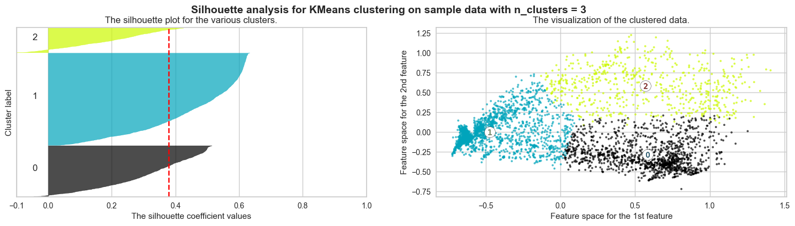
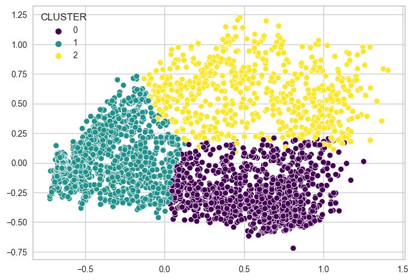
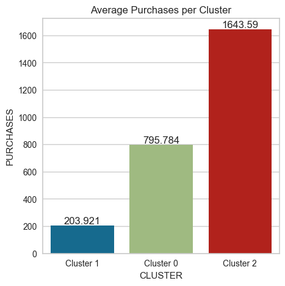
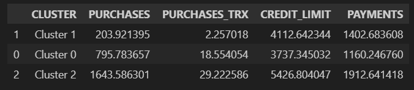

# Credit-Card-Customer-Segmentation
This repository contains an unsupervised machine learning to create a customer segmentation for credit card user based on their credit card usage. The project designed to help the credit card issuer to identified their customer better.

## Project Overview
Credit Card Customer Segmentation projects aim to create a segmentation for credit card customer using unsupervised machine learning with `K-mean Clustering Algorithm`. By analyzing their credit card history usage and identifying patterns, the project can help credit card issuer to identified their customer behavior and giving them rewards & promotion based on their wealth. The project involves exploratory data analysis, data cleaning & preprocessing, feature engineering, model training & evaluation and model improvement.

## Tools and Technologies
- Python
- Jupyter Notebook
- Pandas
- Matplotlib
- Seaborn
- Scikit-learn
- Yellowbrick

## File Description
- `CC_Customer_Segmentation.ipynb` : Jupyter Notebook containing the code used for data cleaning, exploratory data analysis, feature engineering, model training & evaluation and model improvement.
- `CC_Customer_Segmentation_Inference.ipynb` : Jupyter Notebook containing the code for model inference testing.
- `credit_card_data.csv` : CSV file containing the data of Credit Card History.

## Algorithm Used
- K-mean Clustering

## Result
  
  
We dicide that K-means 3 is the best/optimal k-means, because k-means 3 have more separate cluster that we can see the difference which k-means 2 doesn't have. Which is `Cluster 2` from k-means 3, this segmentation showing that the customer with high-income based on their credit card limit and also high-spending based on their purchases and amount of purchases. While on k-means 2 we can't see this at their `Cluster 0`.  
  
<!--   
Above are the result of clustering using `n_cluster=3`, as we can see :
- The average purchase of `Cluster 0`, `Cluster 1` and `Cluster 2` is well separated, customer at `Cluster 1` are those _who use their credit card less_ to purchase item, then `Cluster 0` in the middle, who use their credit card more than `Cluster 1` but less than `Cluster 2`. And last `Cluster 2` looks like a customer with high income, their average purchases is high, average amount of transaction is 29+ transaction. -->

## Conclusion
<!--    -->
The Credit Card Customer Segmentation project was able to successfully create a segmentation for the credit card customer with details as follows :
- `Segment 1` :
A customer who have average income and didn't use their credit card very often as we can see their purchases is low although they have decent credit card limit. But they tend to pay their bill better than segment 2.
- `Segment 2` :
A customer who have same average income with segment 1 because their average credit limit is about the same, but this segment use their credit card more often as we can see their purchases and transaction amount is much more than segment 1.
- `Segment 3` :
A customer who have high-income based on how high their credit card limit is. They also use their credit card very often, their purchases is very high, their transaction amount is also plenty. Also they tend to pay their bills more than the other segment, because their bill is the highest too.

These segmentation information can be used by credit card issuer to give their customer reward and promotion based on their segment.

## Acknowledgements
The Credit Card History data used in this project was obtained from [Google BigQuery](https://console.cloud.google.com/bigquery?p=ftds-hacktiv8-project&d=phase1_ftds_001_sby&t=credit-card-information&page=table)
